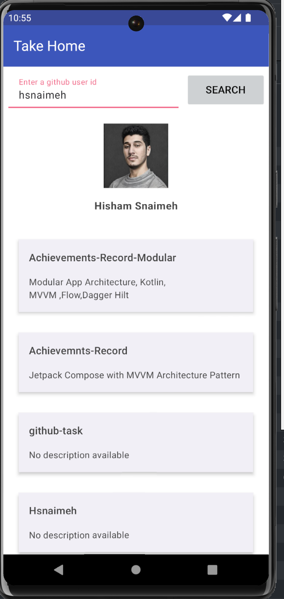
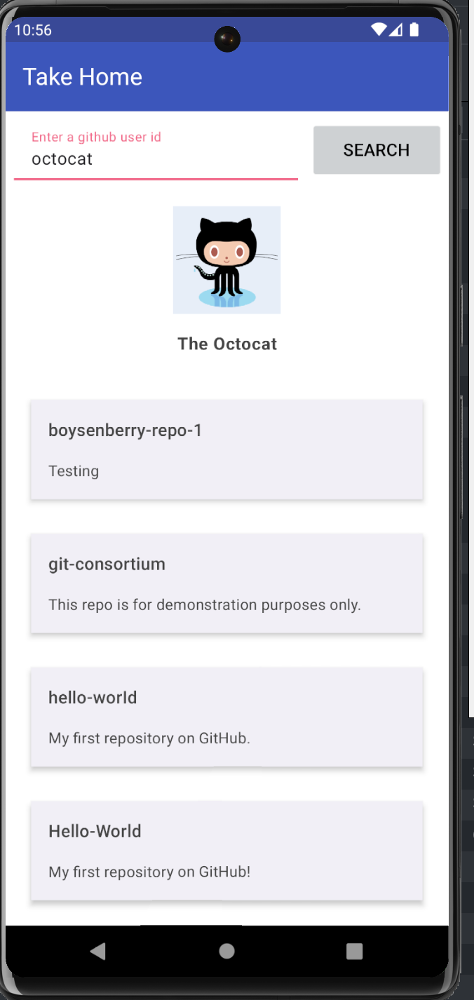
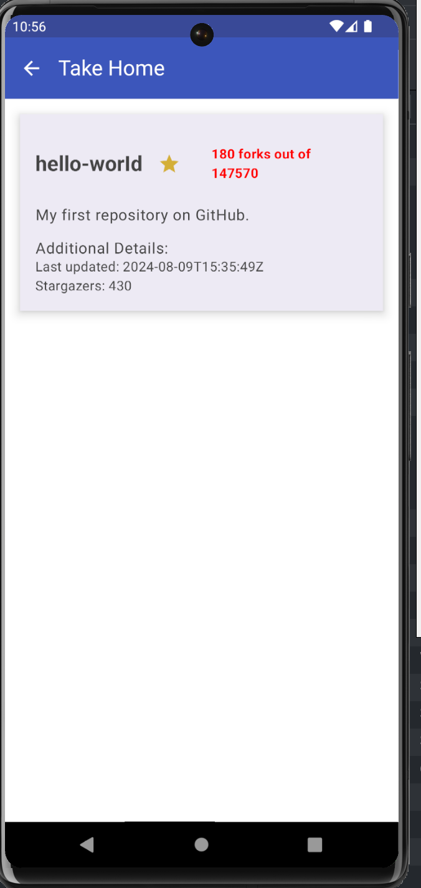

# Hisham GitHub Viewer

Hisham GitHub Viewer is an Android application designed to demonstrate best practices in Android development, including modern architecture, Jetpack Compose, and Hilt for dependency injection. The app allows users to search for GitHub profiles and view their public repositories.

## Table of Contents

- [Hisham GitHub Viewer](#hisham-github-viewer)
  - [Motivation](#motivation)
  - [Architecture Overview](#architecture-overview)
  - [Development Process](#development-process)
  - [Conclusion](#conclusion)
 
## Screenshots

Here are a few screenshots showcasing the app's functionality:

    
    
    

## Video Overview

For a complete overview of the app, watch this video:

    

## Motivation

The primary goal of this project was to showcase my skills in Android development by building a robust, scalable, and maintainable app. I focused on modularization within a single module, organizing the codebase into clear packages that can be expanded into separate modules in future commits. 

## Architecture Overview

The architecture of Hisham GitHub Viewer is built with scalability and maintainability in mind, even within a single module. The app follows a clean architecture approach, separating concerns into distinct packages:

- **data:** Manages data sources, including remote APIs and data mapping.
- **domain:** Contains business logic and use cases, ensuring a clear separation from data handling.
- **presentation:** Handles the UI layer with Jetpack Compose, integrating ViewModels and state management using StateFlow.
- **di:** Manages dependency injection with Hilt, ensuring a modular and testable architecture.

Although the project is currently structured within one module, the design allows for easy expansion into multiple modules in future iterations.

## Development Process

### Initial Setup

The project was set up with a clear separation of concerns within a single module. I prioritized organizing the codebase in a way that supports future modularization.

### Feature Development

- **User Search:** Implemented a feature to search for GitHub users and display their public repositories using Jetpack Compose for UI and StateFlow for state management.
- **Repository Details:** Added a detailed view for selected repositories, displaying additional metadata.

### Testing and Documentation

Due to limited time, comprehensive testing and documentation have not been fully completed. These will be finalized by Sunday, August 11. The current setup includes unit tests for core logic and placeholder UI tests.

## Conclusion

Hisham GitHub Viewer is a solid foundation that demonstrates my ability to build a well-architected Android application. The project is designed to be scalable and maintainable, with the potential for further enhancements and modularization in future iterations.
